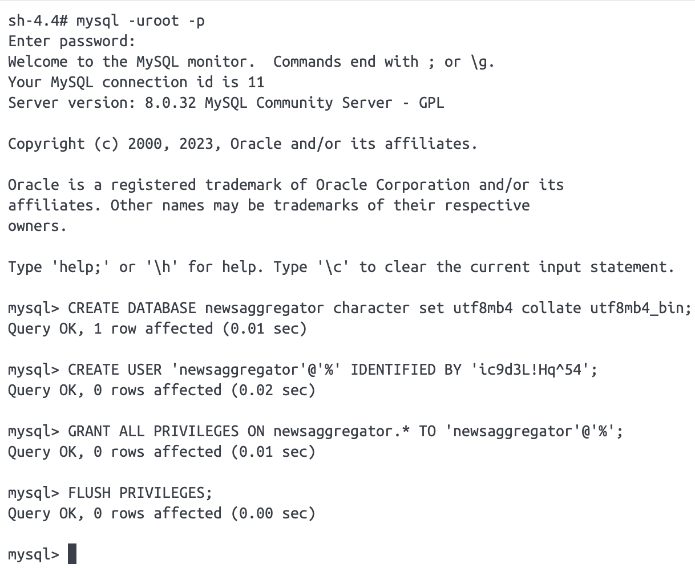

# news-aggregator
Back-office for RSS XML feeds from multiple sources.

# How to set up local environment
## Create a MySQL server instance with docker
The following command can be run to create a docker container for MySQL:
```shell
docker run --name=MySQL -e MYSQL_ROOT_PASSWORD=<root_password> --publish=3306:3306 --hostname=mysqlserver --restart=on-failure --detach mysql/mysql-server:latest
```

Open an interactive shell to access the container with:
```shell
docker exec -it MySQL /bin/bash
```

## Create the database and user
Once in, connect to MySQL with root:
```shell
mysql -uroot -p
```
Then type in the `<root_password>` used when creating the docker container.

Finally, create the database and user, and grant privileges as follows:
```sql
-- Create database.
CREATE DATABASE newsaggregator character set utf8mb4 collate utf8mb4_bin;

-- Create user.
CREATE USER 'newsaggregator'@'%' IDENTIFIED BY 'ic9d3L!Hq^54';

-- Grant privileges.
GRANT ALL PRIVILEGES ON newsaggregator.* TO 'newsaggregator'@'%';

-- Apply changes.
FLUSH PRIVILEGES;
```



## Run the project with gradle
Just use the gradle wrapper and execute the bootRun task:
```shell
./gradlew bootRun
```
